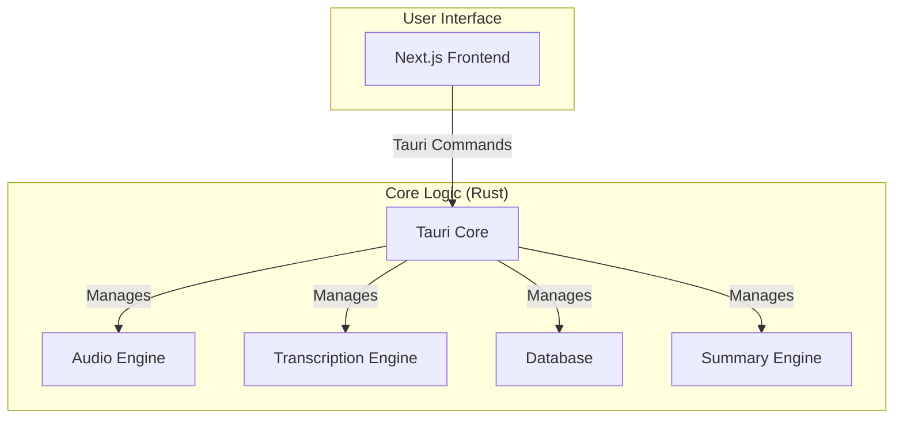

# System Architecture

Meetily is a self-contained desktop application built with [Tauri](https://tauri.app/). It combines a Rust-based backend with a Next.js frontend into a single, efficient, and cross-platform application.

## High-Level Architecture Diagram

## Transcription Pipeline (batch-only)

> Authoritative as of 2026-08-27. If code/comments contradict this section,
> this section wins — some comments predate the batch pivot.

There is exactly **one** transcription path and it is **batch-only**:

- Recording produces **no live transcripts**. Stop-time saves the audio file
  plus an empty meeting row ("no live segments at stop").
- The background transcription queue then runs the same
  `run_retranscription` used by the Enhance dialog.
- The engine is **Whisper-only**: only Whisper rows carry token timestamps,
  which let speaker alignment split text word-exactly; anything else degrades
  to proportional word-count slicing. Parakeet was removed as an engine
  entirely (its persisted configs are migrated at startup by
  `20260827000000_migrate_parakeet_transcript_config.sql`).
- There is no second engine and no live transcription path; do not infer one
  from stale config values.

## Component Details

### Frontend (Next.js)

*   Provides the user interface for managing meetings, displaying transcriptions, and configuring the application.
*   Communicates with the Rust core through Tauri's command system.

### Backend (Rust Core)

*   **Tauri Core:** The heart of the application, responsible for managing the window, handling events, and exposing the Rust core to the frontend.
*   **Audio Engine:** Captures audio from the microphone and system, processes it, and prepares it for transcription.
*   **Transcription Engine:** Uses local Whisper speech-to-text models to transcribe the captured audio. It can be accelerated with a GPU.
*   **Database:** A local SQLite database that stores meeting metadata, transcripts, and summaries.
*   **Summary Engine:** Generates meeting summaries using various Large Language Models (LLMs), including local models via Ollama.
